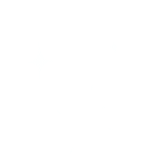

<samp><strong>> Hi! I'm yaya ଘ( ᴖ⩊ᴖ)⊃━☆゜</strong>

  
  

<samp>• Software Developer at [Grupo Boticário](https://www.grupoboticario.com.br/).

<samp>• Computer Science student.

<samp>• Passionate about tech communities and minority inclusion projects.

 
<i><b><samp> let's chat! feel free to contact me :) </i></b>

  

    <b>PT/BR</b>
  

  
---

<samp><strong>> Oi! Eu sou a yaya ଘ( ᴖ⩊ᴖ)⊃━☆゜</strong>

<samp>• Software Developer na [Grupo Boticário](https://www.grupoboticario.com.br/).

<samp>• Estudante de Ciência da Computação

<samp>• Apaixonada por comunidades de tecnologia e projetos de inclusão de minorias.

  
<i><b><samp> vamos conversar! sinta-se livre para me contatar :) </i></b>

 

  
  

◞ ྀི◟ ͜ ◞ ྀི◟ ͜ ◞ ྀི◟◞ ྀི◟ ͜ ◞ ྀི◟ ͜ ◞ ྀི◟ ͜ ◞ ྀི◟ ͜ ◞ ྀི◟◞ ྀི◟ ͜ ◞ ྀི◟ ͜ ◞ ྀི◟ ͜ ◞ ྀི◟ ͜ ◞ ྀི◟◞ ྀི◟ ͜ ◞ ྀི◟ ͜ ◞ ྀི◟ ͜ ◞ ྀི◟ ͜ ◞ ྀི◟◞ ྀི◟ ͜ ◞ ྀི◟ ͜ ◞ ྀི◟ ͜ ◞ ྀི◟ ͜ ◞ ྀི◟◞ ྀི◟ ͜ ◞ ྀི◟ ͜ ◞ ྀི◟
##

<samp><strong>> <u>skills</u>︵ ｡ ૭ৎ</strong>

#
︵   ⑅ ︵   ⑅ ︵   ⑅ ︵   ⑅ ︵   ⑅ ︵   ⑅ ︵   ⑅ ︵   ⑅ ︵   ⑅ ︵   ⑅ ︵   ⑅ ︵   ⑅ ︵   ⑅ ︵   ⑅ ︵   ⑅ ︵   ⑅ ︵   ⑅ ︵   ⑅ ︵   ⑅ ︵   ⑅ ︵   ⑅ ︵   ⑅ ︵   ⑅ ︵   ⑅ ︵   ⑅ ︵   ⑅ ︵   ⑅ ︵   ⑅ ︵   ⑅ ︵
 
<samp> 
  "𝘌𝘷𝘦𝘯 𝘪𝘧 𝘺𝘰𝘶 𝘢𝘳𝘦 𝘯𝘰𝘵 𝘳𝘦𝘢𝘥𝘺 𝘧𝘰𝘳 𝘵𝘩𝘦 𝘥𝘢𝘺, 𝘪𝘵 𝘤𝘢𝘯𝘯𝘰𝘵 𝘢𝘭𝘸𝘢𝘺𝘴 𝘣𝘦 𝘯𝘪𝘨𝘩𝘵."
 

︵   ⑅ ︵   ⑅ ︵   ⑅ ︵   ⑅ ︵   ⑅ ︵   ⑅ ︵   ⑅ ︵   ⑅ ︵   ⑅ ︵   ⑅ ︵   ⑅ ︵   ⑅ ︵   ⑅ ︵   ⑅ ︵   ⑅ ︵   ⑅  ︵   ⑅ ︵   ⑅ ︵   ⑅ ︵   ⑅ ︵   ⑅ ︵   ⑅ ︵   ⑅ ︵   ⑅ ︵   
